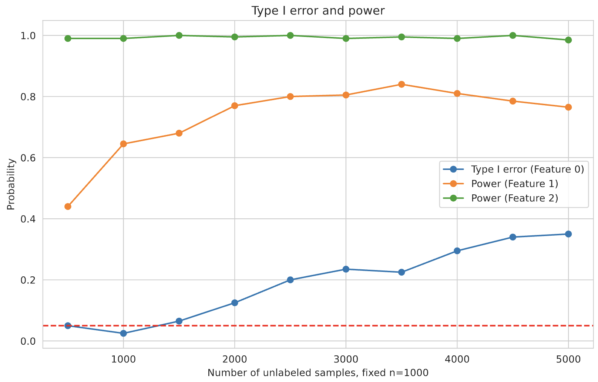
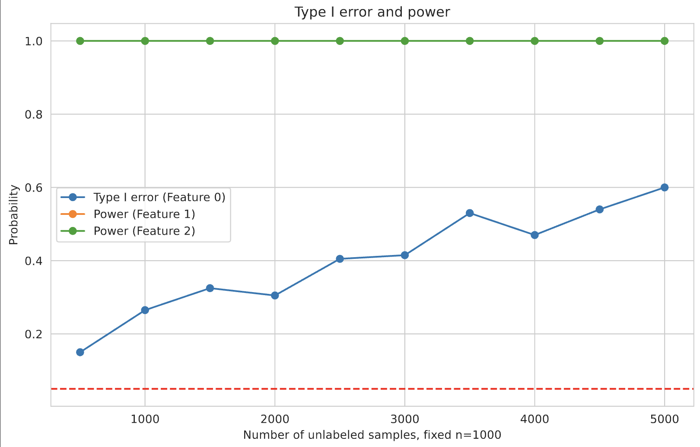
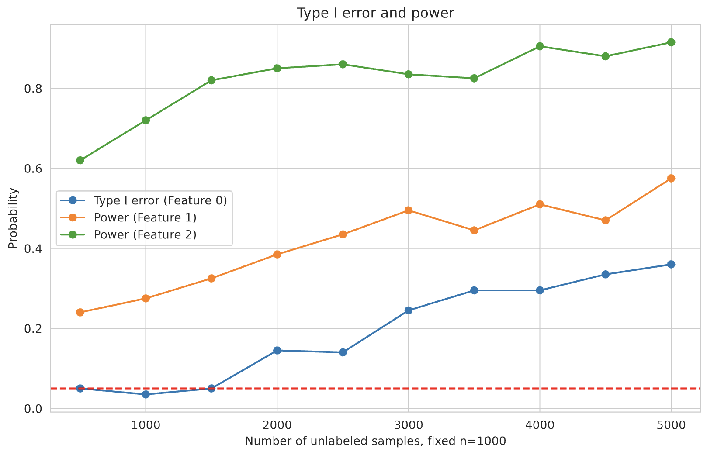

# ppi-experiments
Experiments for ppi and related methods

## Setup

### Data Generation

- `n`: number of labeled data (default 1000)
- `m`: number of unlabeled data (no default value, varing from 500 to 3000)
- `p`: number of features (default 10)
- `sigma`: variance of noise (default 1)

We denote the true parameter as $\beta$, and the first three elements of $\beta$ is $0, 0.05, 0.10$

## Results
### Standard Normal Design

### Standard Cauchy Design

### Uniform

The results show that the type I error control and power is related to the covariate $X$, which need further consideration. The deduction last time is totally wrong.

## To-do

### Meeting 1
**June 20 / 2024**

- [x] Literature review (including the paper: https://arxiv.org/abs/2405.18379 and the reference here in);
- [ ] deduction based on an identical cov; and the results based on a general covariance matrix;

### Meeting 2
**June 28 / 2024**
**PPI + Prob Calibration**
- [ ] when f is an unbiased estimator of P(Y=1|x): (i) provide prob as psudo-label; (ii) provide pred label as psudo-label; Method (1) and (1')
- [ ] when f is an biased estimator of P(Y=1|x): compare five methods; different frameworks to debias;
