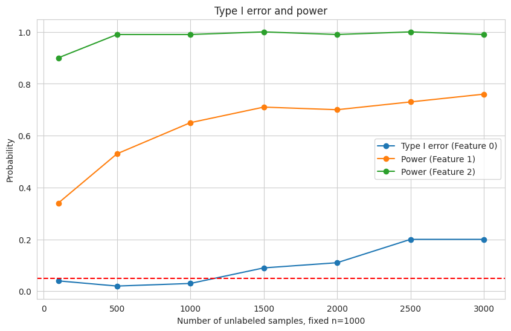

# ppi-experiments
Experiments for ppi and related methods

## Setup

### Data Generation

- `n`: number of labeled data (default 1000)
- `m`: number of unlabeled data (no default value, varing from 500 to 3000)
- `p`: number of features (default 10)
- `sigma`: variance of noise (default 1)

We denote the true parameter as $\beta$, and the first three elements of $\beta$ is $0, 0.05, 0.10$

## Results

## To-do

### Meeting 1
**June 20 / 2024**

- [ ] Literature review (including the paper: https://arxiv.org/abs/2405.18379 and the reference here in);
- [ ] deduction based on a identical cov;
- [ ] and the results based on a general covariance matrix;